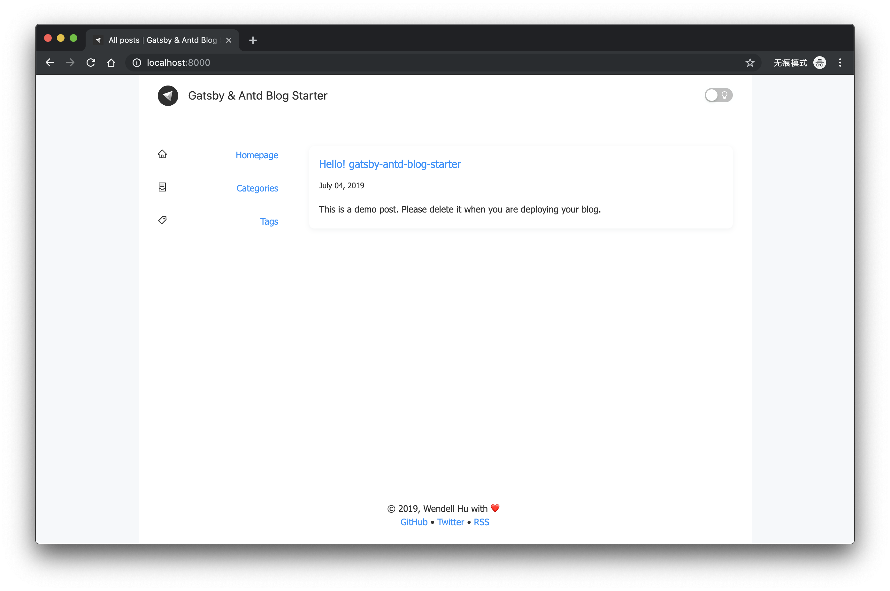
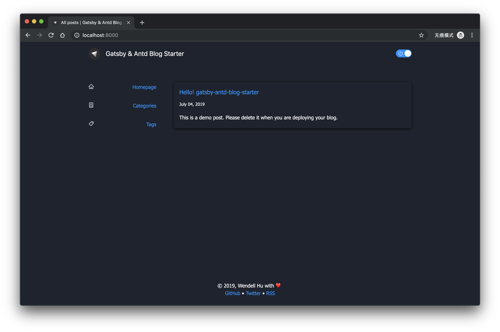

<h1 align="center">
gatsby-antd-blog-starter
</h1>

Use this boilerplate to build your blog with [Ant Design](https://ant.design) flavor!

[Demo](https://gatsby-antd-blog-starter.silicic-acid.now.sh/)

## 🚀 Quick Start

### Installation

Create a new project with this command (assuming that you already have Gatsby CLI installed!)

```sh
gatsby new my-blog https://github.com/silicic-acid/gatsby-antd-blog-starter
```

And run it with this command:

```sh
yarn start
```

And open http://localhost:8000 in your browser.

Bang! 🎉



### ✍️ Write a new Article

Follow these steps to write a new article:

- Create a dir under /content/blog/.
- Create an index.md file which would be considered as a post in the default language.
  - All static resources can be put into the same dir.
  - (Optional) Create translations with name this pattern `index.{languageId}.md`.

#### Metadata

You can use these properties for an article:

- title
- date
- description
- (Optional) category. Please make sure you use keys in posts, and write translations in i18n.js.
- (Optional) tags. Please make sure you use keys in posts, and write translations in i18n.js.

## ✨ Features

- Responsive design
- Dark mode
- Multiple languages
- Categories & Tags
- RSS
- Integration with [Now](https://zeit.co)

### 🌛 Dark Mode

This starter provides a build-in **dark mode**.



### Integration with Now

This starter comes with integration with Now. If you don't want to use Now, you can remove now.json and the script `now-build` in package.json.

## 🎉 Users

- [The official blog of team NG-ZORRO](https://ng.ant.design/blog)

## ☀️ License

MIT
